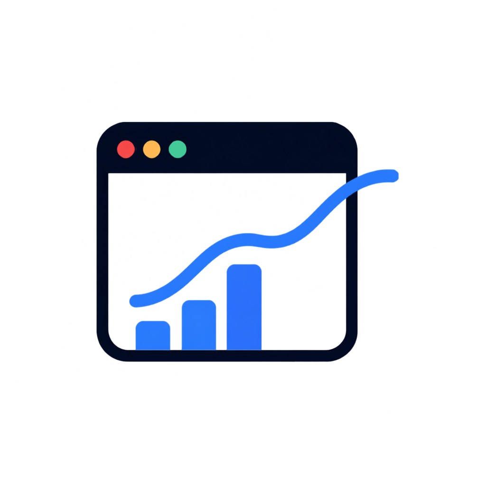
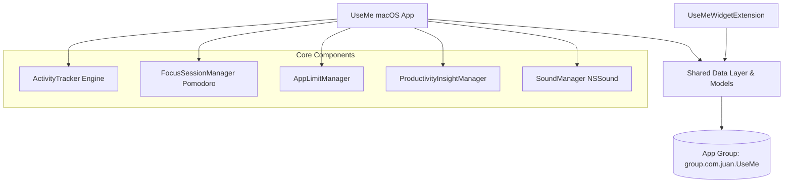

<p align="center">
  
</p>

<h1 align="center">Use Me</h1>

<p align="center">
  <strong>Native Screen Time & Laptop Usage Tracker with Interactive Widgets for macOS</strong>
</p>

<p align="center">
  <a href="#features"></a>
  <a href="#tech-stack"></a>
  <a href="#tech-stack"></a>
  <a href="#license"></a>
</p>

---

## 📖 Overview

**Use Me** adalah aplikasi pelacak penggunaan laptop (*screen time*) native untuk macOS (Sonoma & Sequoia) yang dirancang untuk membantu Anda memahami kebiasaan digital, meningkatkan fokus, dan membatasi distraksi.

Aplikasi ini hadir dengan **Widget Desktop Interaktif**, **Mode Fokus (Pomodoro)**, **Batas Penggunaan Aplikasi (App Limits)**, **Skor Produktivitas**, dan **Menu Bar Accessory** yang ringan serta hemat baterai.

---

## ✨ Fitur Unggulan

### 1. 🖥️ Interactive Desktop & Notification Center Widgets
- Mendukung tiga ukuran widget native: **Small**, **Medium**, dan **Large**.
- **One-Click In-Widget Switcher**: Mengubah periode tampilan (**Harian**, **Mingguan**, **Bulanan**) langsung dari permukaan widget di desktop tanpa membuka aplikasi, ditenagai oleh `AppIntents` dan `Button(intent:)`.
- Cincin progres dinamis dengan warna adaptif (Biru: Normal, Oranye: Mendekati target, Merah: Melampaui target).

### 2. ⏱️ Core Tracking Engine Latar Belakang
- Pelacakan interval 1-detik dengan deteksi **Idle otomatis** (`CGEventSource.secondsSinceLastEventType`).
- Deteksi otomatis saat laptop **Sleep / Wake** dan **Screen Lock / Unlock**.
- Pencatatan durasi aplikasi yang sedang aktif di layar depan (`NSWorkspace.shared.frontmostApplication`).
- Buffer data efisien yang meminimalkan operasi penulisan disk.

### 3. 🎯 Mode Fokus & Pomodoro (Deep Work)
- Siklus terstruktur: **25 menit kerja fokus + 5 menit istirahat teratur**.
- Countdown live terintegrasi langsung di **Menu Bar Extra** (misal: `💻 2j 15m • 🎯 22:45`).
- **Efek Suara Sistem macOS (`NSSound`)**: Suara *"Glass"* saat fokus selesai dan *"Ping"* saat istirahat berakhir.
- Penghitung sesi fokus harian yang tersimpan persisten.

### 4. ⏳ Batas Penggunaan per Aplikasi (App Limits)
- Tentukan kuota durasi harian untuk aplikasi tertentu (30 Menit s/d 4 Jam).
- Notifikasi peringatan instan (`UNUserNotificationCenter`) dan suara alarm *"Basso"* saat batas penggunaan aplikasi terlampaui.

### 5. 📊 Analisis & Skor Produktivitas
- **Skor Produktivitas (0–100)**: Dihitung otomatis berdasarkan klasifikasi 6 kategori aplikasi (*Development*, *Productivity*, *Design*, *Utilities*, *Browsing*, *Entertainment*).
- **Perbandingan Tren**: Mengetahui apakah screen time Anda meningkat atau menurun dibanding periode sebelumnya (misal: `↑ 12% vs kemarin`).
- **Insight Cerdas**: Rekomendasi kontekstual berbahasa Indonesia untuk menjaga keseimbangan digital.

### 6. 📅 Browser Riwayat Kalender & Ekspor Data
- Jelajahi riwayat penggunaan hari-hari sebelumnya dengan DatePicker terintegrasi.
- Ekspor seluruh data aktivitas ke file **CSV** (siap dianalisis di Excel/Numbers/Google Sheets) dan **JSON**.

### 7. 🚀 Kenyamanan Penggunaan Sistem
- **Mulai Otomatis saat Login (*Launch at Login*)**: Berjalan otomatis di latar belakang saat MacBook dinyalakan menggunakan Apple `SMAppService`.
- **Mode Menu Bar Saja**: Opsi untuk menyembunyikan ikon dari Dock macOS agar murni beroperasi di bilah menu atas.
- **Daftar Pengecualian Aplikasi (*App Ignore List*)**: Kecualikan aplikasi utilitas atau background dari perhitungan waktu aktif.

---

## 🏛️ Arsitektur Proyek

Proyek ini dibangun secara modular menggunakan Swift murni tanpa dependensi eksternal:



### Struktur Folder
```
UseMe/
├── Shared/                           # Lapisan data dan model bersama
│   ├── UsageRecord.swift             # Model data riwayat & kalkulasi ringkasan
│   ├── UsageTimeframe.swift          # Enum periode (Harian, Mingguan, Bulanan)
│   ├── SharedDataManager.swift       # Jembatan penyimpanan App Group
│   ├── AppCategory.swift             # Auto-classifier 6 kategori aplikasi
│   ├── GoalManager.swift             # Target harian & notifikasi threshold
│   ├── AppLimitManager.swift         # Pengatur batas waktu aplikasi
│   ├── FocusSessionManager.swift     # Timer Pomodoro 25m/5m
│   ├── ProductivityInsightManager.swift # Mesin skor produktivitas & tren
│   ├── SoundManager.swift            # Audio alerts native macOS
│   ├── ExportManager.swift           # Generator ekspor CSV & JSON
│   ├── AppIgnoreManager.swift        # Daftar aplikasi yang diabaikan
│   └── ChangeWidgetTimeframeIntent.swift # In-widget interactive AppIntent
├── UseMe/                            # Target Aplikasi Utama macOS
│   ├── UseMeApp.swift                # App Lifecycle, WindowGroup & MenuBarExtra
│   ├── ContentView.swift             # Dashboard SwiftUI lengkap
│   ├── Services/
│   │   ├── ActivityTracker.swift     # Background activity & idle monitor
│   │   └── LaunchAtLoginManager.swift # SMAppService wrapper
│   └── Assets.xcassets/              # AppIcon, AppLogo, Colorsets
├── UseMeWidget/                      # Target WidgetKit Extension
│   ├── UseMeWidgetBundle.swift       # Widget registration bundle
│   ├── UseMeWidget.swift             # Small, Medium, Large widget views
│   └── UseMeAppIntent.swift          # AppIntent configuration
└── assets/                           # Asset dokumentasi & branding
```

---

## 🛠️ Persyaratan Sistem & Kompilasi

### Persyaratan
- **macOS:** macOS 14.0 (Sonoma) atau yang lebih baru
- **Xcode:** Xcode 15.0 atau yang lebih baru
- **Swift:** Swift 5.9+

### Build dari Terminal

```bash
# Clone repository
git clone https://github.com/Jayflux/UseMe.git
cd UseMe

# Build Aplikasi Utama
DEVELOPER_DIR=/Applications/Xcode.app/Contents/Developer xcodebuild \
  -project UseMe.xcodeproj \
  -scheme UseMe \
  -destination 'platform=macOS' \
  CODE_SIGNING_ALLOWED=NO build

# Build Widget Extension
DEVELOPER_DIR=/Applications/Xcode.app/Contents/Developer xcodebuild \
  -project UseMe.xcodeproj \
  -scheme UseMeWidgetExtension \
  -destination 'platform=macOS' \
  CODE_SIGNING_ALLOWED=NO build
```

---

## 💻 Panduan Penggunaan Singkat

1. **Buka Aplikasi:**
   Jalankan `UseMe.app`. Ikon laptop `💻` akan langsung muncul di Menu Bar pojok kanan atas layar Anda.
2. **Lihat Dashboard:**
   Klik ikon di Menu Bar → pilih **"Buka Dashboard"**.
3. **Pasang Widget Desktop:**
   Klik kanan di Desktop macOS Anda → pilih **"Edit Widgets..."** → cari **"Use Me"** → pilih ukuran dan seret ke Desktop.
4. **Ganti Periode di Widget:**
   Pada widget Medium dan Large, klik tombol **[Hari] [Mgg] [Bln]** langsung di atas widget untuk berpindah data seketika.

---

## 📜 Lisensi

Proyek ini dilisensikan di bawah lisensi [MIT](LICENSE). Dibuat oleh **[Juan](https://github.com/Jayflux)**.
