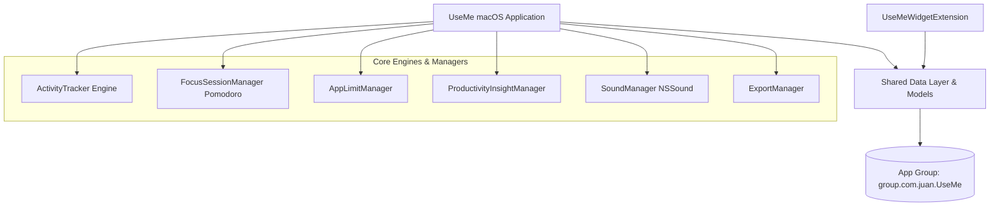

<p align="center">
  
</p>

<h1 align="center">Use Me</h1>

<p align="center">
  <strong>A native macOS screen time tracker, productivity suite, and interactive desktop widget app.</strong>
</p>

<p align="center">
  <a href="#features"></a>
  <a href="#tech-stack"></a>
  <a href="#tech-stack"></a>
  <a href="#license"></a>
</p>

---

## 📖 Overview

**Use Me** is a high-performance, battery-friendly macOS application designed to help you gain clarity over your digital habits, cultivate deep focus, and control distracting screen time.

Built entirely with Apple's modern frameworks (**SwiftUI**, **WidgetKit**, **AppIntents**, and **Swift Charts**), **Use Me** integrates seamlessly into macOS Sonoma & Sequoia as both an interactive desktop widget and a persistent Menu Bar companion.

---

## ✨ Features

### 1. 🖥️ Interactive Desktop & Notification Center Widgets
- **Three Widget Sizes**: Small, Medium, and Large widgets with vibrant light and dark mode styling.
- **One-Click In-Widget Timeframe Switcher**: Switch between **Daily**, **Weekly**, and **Monthly** metrics directly on the desktop surface using `AppIntents` and `Button(intent:)` without ever opening the main window.
- **Adaptive Goal Ring**: Color-coded progress ring that transitions dynamically from Blue (on track) to Orange (approaching limit) and Red (goal exceeded).

### 2. ⏱️ Core Tracking Engine
- **Precise 1-Second Sampling**: Real-time duration tracking for active frontmost applications via `NSWorkspace.shared.frontmostApplication`.
- **Intelligent Idle Detection**: Automatically pauses active time accumulation when inactive using `CGEventSource.secondsSinceLastEventType`.
- **System Event Observers**: Seamlessly handles Mac sleep, wake, screen lock, and screen unlock events.
- **Low-I/O Buffered Persistence**: In-memory buffer periodically flushes to disk to ensure minimal battery impact.

### 3. 🎯 Deep Work & Pomodoro Timer
- **Structured Productivity Cycles**: 25 minutes of deep focus followed by a 5-minute restorative break.
- **Live Menu Bar Countdown**: Real-time status in the system menu bar (e.g. `💻 2h 15m • 🎯 22:45`).
- **Native macOS Audio Alerts (`NSSound`)**: Plays system sounds (*"Glass"* on focus completion, *"Ping"* when break ends).
- **Daily Session Counter**: Tracks and stores completed focus sessions throughout the day.

### 4. ⏳ Per-App Daily Usage Limits
- **Custom App Limits**: Set daily duration thresholds for individual applications (from 30 minutes to 4 hours).
- **Proactive Alerts**: Sends local system notifications (`UNUserNotificationCenter`) and warning sound alerts (*"Basso"*) when limits are reached.

### 5. 📊 Productivity Score & Trend Analytics
- **Productivity Score (0–100)**: Automatically calculated using weighted ratios across 6 application categories (*Development*, *Productivity*, *Design*, *Utilities*, *Browsing*, and *Entertainment*).
- **Period Trend Comparisons**: Visual indicators showing usage fluctuations compared to prior periods (e.g. `↑ 12% vs yesterday`).
- **Contextual Insights**: Dynamic recommendations and feedback based on your daily app distribution.

### 6. 📅 Historical Date Browser & Data Export
- **Historical Calendar Navigator**: Explore past days' hourly breakdowns and top applications with an intuitive `DatePicker`.
- **Data Export**: Export your complete usage history to structured **CSV** (for Excel, Google Sheets, or Numbers) and formatted **JSON** with native `NSSavePanel`.

### 7. 🚀 Everyday Convenience
- **Launch at Login**: Starts automatically at boot using Apple's modern `SMAppService.mainApp` API.
- **Menu Bar Only Mode**: Option to hide the app icon from the macOS Dock, running discreetly as a status bar utility.
- **App Ignore List**: Easily exclude background utilities or screensavers from screen time calculations.
- **Smart Window Management**: Closing the dashboard window with `Cmd+W`, `Cmd+Q`, or the red close button hides the window to the Menu Bar without terminating the tracker.

---

## 🏛️ Architecture



### Directory Structure
```
UseMe/
├── Shared/                               # Shared data layer and business logic
│   ├── UsageRecord.swift                 # Data models, aggregations, & summaries
│   ├── UsageTimeframe.swift              # Timeframe definitions (Daily, Weekly, Monthly)
│   ├── SharedDataManager.swift           # App Group persistence bridge
│   ├── AppCategory.swift                 # 6-category automatic app classifier
│   ├── GoalManager.swift                 # Daily screen time goal & notification thresholds
│   ├── AppLimitManager.swift             # Per-app duration limits engine
│   ├── FocusSessionManager.swift         # Pomodoro timer engine (25m/5m)
│   ├── ProductivityInsightManager.swift  # 0-100 productivity score & trend analysis
│   ├── SoundManager.swift                # Native macOS NSSound audio cues
│   ├── ExportManager.swift               # CSV & JSON export generator
│   ├── AppIgnoreManager.swift            # Excluded applications manager
│   └── ChangeWidgetTimeframeIntent.swift # In-widget interactive AppIntent
├── UseMe/                                # Main macOS Application Target
│   ├── UseMeApp.swift                    # Lifecycle, WindowGroup & MenuBarExtra
│   ├── ContentView.swift                 # Main SwiftUI dashboard
│   ├── Services/
│   │   ├── ActivityTracker.swift         # 1-sec tracking loop & idle detector
│   │   └── LaunchAtLoginManager.swift    # SMAppService wrapper
│   └── Assets.xcassets/                  # AppIcon, AppLogo, Colorsets
├── UseMeWidget/                          # WidgetKit Extension Target
│   ├── UseMeWidgetBundle.swift           # Widget registration bundle
│   ├── UseMeWidget.swift                 # Small, Medium, Large widget views
│   └── UseMeAppIntent.swift              # WidgetConfigurationIntent
└── assets/                               # Repository documentation assets
```

---

## 🛠️ Requirements & Building

### Requirements
- **OS**: macOS 14.0 (Sonoma) or newer
- **IDE**: Xcode 15.0 or newer
- **Toolchain**: Swift 5.9+

### Build via Terminal

```bash
# Clone the repository
git clone https://github.com/Jayflux/UseMe.git
cd UseMe

# Build the main application
DEVELOPER_DIR=/Applications/Xcode.app/Contents/Developer xcodebuild \
  -project UseMe.xcodeproj \
  -scheme UseMe \
  -destination 'platform=macOS' \
  CODE_SIGNING_ALLOWED=NO build

# Build the WidgetKit Extension
DEVELOPER_DIR=/Applications/Xcode.app/Contents/Developer xcodebuild \
  -project UseMe.xcodeproj \
  -scheme UseMeWidgetExtension \
  -destination 'platform=macOS' \
  CODE_SIGNING_ALLOWED=NO build
```

---

## 💡 Quick Start Guide

1. **Launch the App**:
   Open `UseMe.app`. You will see a laptop icon `💻` with your current active duration appear in the top-right Menu Bar.
2. **Access the Dashboard**:
   Click the Menu Bar icon → select **"Buka Dashboard"** (Open Dashboard) to view detailed charts, Pomodoro controls, and analytics.
3. **Add Desktop Widgets**:
   Right-click on your macOS Desktop → select **"Edit Widgets..."** → search for **"Use Me"** → choose your preferred size (**Small**, **Medium**, or **Large**) and drag it to your screen.
4. **Switch Timeframes on Desktop**:
   On Medium and Large widgets, click the **[Hari] [Mgg] [Bln]** buttons directly on the widget to switch between Daily, Weekly, and Monthly data in real-time.

---

## 📜 License

This project is licensed under the [MIT License](LICENSE).  
